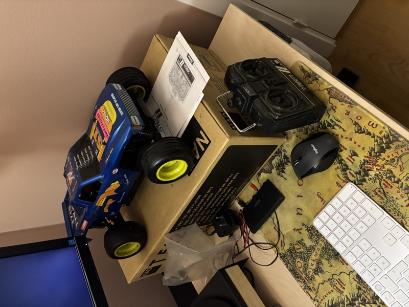

# Sandmaster ST Nitro Truck Restoration

**Bringing a 30-year-old RC truck back to life - with a little help from AI.**

<p align="center">
  
  <br>
  <em>From flea market find to roaring engine</em>
</p>

---

## The Story

Back in 2023, I found a dusty Kyosho Sandmaster ST at a flea market in Norway. It was a complete 1994 nitro-powered RC truck - transmitter, manual, everything in the original box. The seller had no idea if it worked. Neither did I. I'd never touched an RC car in my life, let alone a nitro engine.

**So I bought it.** Then it sat on a shelf for two years.

In late 2025, I finally decided to do something about it. This repository documents the entire restoration journey - from "what even is a glow plug?" to hearing the engine roar for the first time after three decades of silence.

### The Twist

I'm a software engineer, not a mechanic. My approach? Pair programming with [Claude Code](https://claude.com/claude-code). Every step of this restoration has been documented through conversations with an AI assistant - from identifying corroded battery terminals to diagnosing why the pull starter wouldn't retract.

This isn't just a restoration log. It's an experiment in using AI for hands-on, real-world problem solving.

---

## Current Status

### ✅ ENGINE RUNS! (January 2026)

After cleaning 30 years of gunk from the fuel system, replacing corroded electronics, and learning what a needle valve does the hard way, **the engine started successfully on January 17th, 2026**.

The journey included:
- 🧼 Washing decades of dirt off the chassis and body - revealing a surprisingly nice glossy finish underneath
- 🔋 Cleaning battery corrosion with vinegar (the NiCd batteries had leaked everywhere)
- 📻 Replacing mismatched radio crystals (TX and RX had different frequencies - no wonder it didn't work!)
- 🔌 Installing a new battery holder and power switch for the receiver
- ⛽ Flushing varnished fuel from the tank with isopropanol - the old fuel had turned to blue-green gunk
- 🔧 Disassembling and cleaning a pull starter whose cord had become stiff from 30 years of dirt buildup
- 🔥 Learning that glow plugs need to be *really* hot before pulling
- 😅 Accidentally getting nitro fuel in my mouth while priming (don't do this)

**What's next:** Finding a place to actually drive this thing (apartment balconies are not ideal for nitro engines).

---

## The Truck

| | |
|---|---|
| **Manufacturer** | Kyosho |
| **Model** | Sandmaster ST |
| **Year** | ~1994 |
| **Scale** | 1:10 |
| **Engine** | Kyosho GS11X (.11 cubic inch, 2-stroke nitro) |
| **Radio** | Hitec Ranger II 2-channel AM (27 MHz) |

The Sandmaster ST is a stadium truck - a type of RC vehicle designed for off-road racing with large rear tires and a pickup truck-style body. It was a mid-range offering from Kyosho, a Japanese manufacturer known for quality RC vehicles.

---

## Repository Contents

```
images/
├── truck/          # 34 photos documenting condition and repairs
├── transmitter/    # Radio transmitter photos
└── accessories/    # Charger and other parts

docs/
├── manual/         # Original manuals (60+ scanned pages)
│   ├── assembly/   # Assembly instructions
│   ├── radio/      # Radio system manual
│   └── other/      # Engine docs, parts lists
├── INSPECTION_RESULTS.md  # Detailed restoration log with all sessions
├── IMAGE_INDEX.md         # Complete photo catalog
├── SHOPPING_LIST.md       # Parts purchased and costs
└── ...
```

---

## Restoration Timeline

| Session | Date | Milestone |
|---------|------|-----------|
| 1 | Nov 2025 | Initial inspection - discovered crystal mismatch, corroded batteries |
| 2 | Dec 2025 | Parts installed - glow plug, crystals, battery holder. Radio works! |
| 3 | Dec 2025 | First start attempt - failed. Pull starter too weak, fuel not reaching engine |
| 3b | Dec 2025 | Root cause found - pull starter cord stiff from 30 years of dirt |
| 4 | Jan 2026 | Pull starter cleaned and lubricated - works perfectly |
| 5 | Jan 2026 | **SUCCESS!** Engine starts and runs! |

Full details in [INSPECTION_RESULTS.md](docs/INSPECTION_RESULTS.md).

---

## Parts & Cost

Total restoration cost: **~1020 NOK** (~$95 USD)

| Item | Source | Cost |
|------|--------|------|
| OS 8 Glow Plug | Elefun.no | 89 kr |
| HPI Nitro Starter Pack | Elefun.no | 356 kr |
| 27.145 MHz Crystal Pair | AliExpress | 46 kr |
| Battery holder + switch | AliExpress | 28 kr |
| Nitro fuel 16% (2.5L) | Local hobby shop | ~400 kr |
| Various small parts | - | ~100 kr |

Not bad for bringing a 30-year-old machine back to life!

---

## Lessons Learned

1. **Old fuel turns to varnish.** If a nitro RC has been sitting for years, the fuel system is probably gummed up. Isopropanol (IPA) is your friend.

2. **Crystal frequencies must match.** TX and RX need identical crystals. Ours were mismatched from the factory or a previous owner - an easy fix once diagnosed.

3. **The pull starter is mechanical.** When it won't retract, it's usually dirt, not a broken spring. A thorough cleaning brought ours back to life.

4. **Patience beats parts.** Our first instinct was often "something must be broken, let's replace it." But most issues were solved with cleaning, not new parts.

5. **AI is surprisingly good at debugging hardware.** Describing symptoms to Claude Code and working through hypotheses together was genuinely useful for someone with zero RC experience.

---

## About This Project

This restoration was documented as part of an experiment in using AI assistants for real-world, hands-on projects. Every troubleshooting session, parts decision, and documentation update was done in collaboration with [Claude Code](https://claude.com/claude-code).

**Author:** [Fridtjof](https://github.com/Fridtjon)

If you have an old RC car sitting in a box somewhere, maybe it's time to bring it back to life. Feel free to use this repo as inspiration or reference!

---

## License

Documentation and images are provided for educational purposes. Original Kyosho manuals remain property of Kyosho Corporation.
